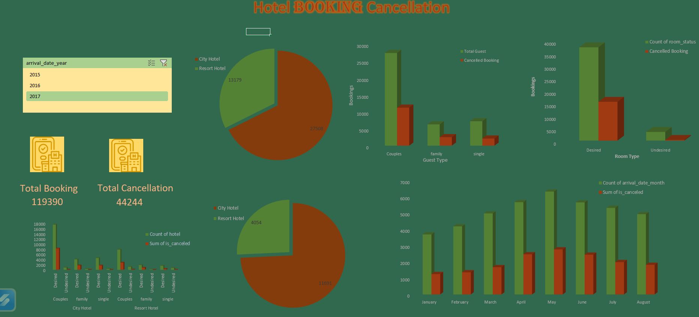
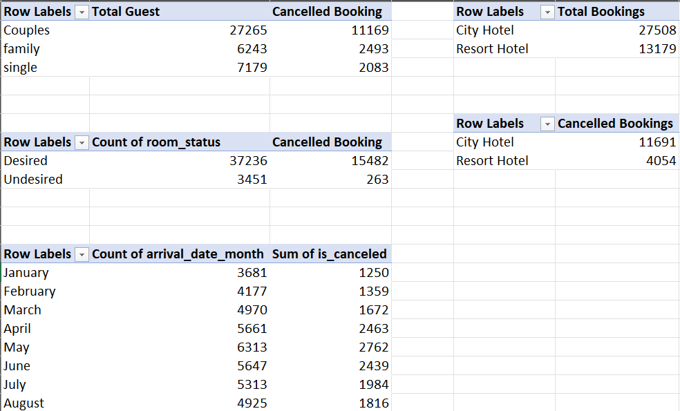

# 🏨 Hotel Booking Data Analysis Project

## 📋 Project Overview
This project analyzes a comprehensive hotel booking dataset to uncover guest preferences and booking behaviors. The primary goal was to identify the root causes of cancellations and provide data-driven recommendations to improve hotel occupancy and revenue.

## 📊 Dashboard Highlights
The interactive Excel Dashboard provides a visual summary of the following KPIs:
* **Total Bookings & Cancellations:** Real-time tracking of booking status.
* **Average Daily Rate (ADR):** Monitoring revenue performance across different hotel types.
* **Guest Segmentation:** Breakdown of Single, Couple, and Family travelers.
* **Monthly Trends:** Visualizing peak arrival months to optimize staffing and pricing.

---

## 🛠️ Tools & Techniques Used
* **Data Cleaning:** Used **Excel Power Query** to remove duplicates, handle null values in the `country` column, and format dates.
* **Analysis:** Created **Pivot Tables** to segment data by room type, guest category, and cancellation status.
* **Visualization:** Designed an interactive dashboard using **Slicers, Timelines, and Dynamic Charts** (Donut, Clustered Bar, and Line charts).

---

## 💡 Key Business Insights
* **Cancellation Drivers:** Guests who were assigned a room type different from their "Desired Room" showed a significantly higher cancellation rate.
* **Lead Time Impact:** Analysis suggests that bookings made more than **150 days in advance** are more prone to cancellations.
* **Revenue Peak:** **City Hotels** see a major spike in revenue during the spring, while **Resort Hotels** dominate the summer months.

---

## 📂 Project Files
* **[hotel_booking_data.xlsx](hotel_booking_data.xlsx):** The main workbook containing the Data, Pivot Tables, and Dashboard.
* **Dashboard Preview:** A screenshot of the final dashboard for quick viewing.
* **Pivot Tbale preview:** A screenshot of the important pivot table for quick understanding.

---

### 📊 Quick Data Snapshot
| Metric | City Hotel | Resort Hotel |
| :--- | :--- | :--- |
| **Total Bookings** | 27,508 | 13,179 |
| **Cancellations** | 11,691 | 4,054 |
| **Cancellation Rate** | ~42% | ~30% |

---

## 🚀 How to View the Project
1. **Download** the `.xlsx` file from the file list above.
2. **Open** the file in Microsoft Excel.
3. Use the **Slicers** on the dashboard to filter data by Hotel Type, Deposit Type, or Arrival Year.

**Author:** [Astha Jadon]  
**Contact:** [www.linkedin.com/in/aastha-jadon-297890294]
